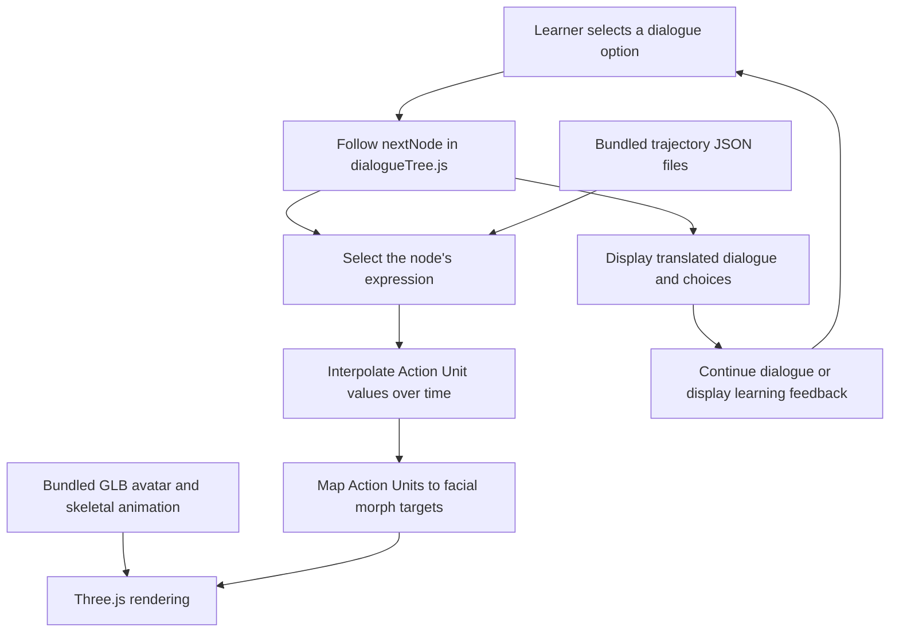

# CLIKK

### A socially interactive agent for Chinese language learning

CLIKK is a browser-based seminar prototype that combines a 3D conversational avatar, branching dialogue, facial animation, and contextual learning feedback. It explores how nonverbal behaviour and social expectations can be translated from research into an interactive learning experience.

Developed for the **How to Build a Social Computer** seminar, the project targets advanced learners of Chinese, approximately **CEFR B2**, with German-speaking learners as the original target audience.

The implemented scenario takes place at dinner with **Mrs. Zhang**, a Chinese colleague in a more senior position. When the bill arrives, learners choose how to respond to her offer to pay. Different choices explore hospitality, hierarchy, polite refusal, and reciprocity through dialogue and animated reactions.

> CLIKK is an exploratory educational prototype. Its scenario represents a particular social context, and its evaluation does not establish that the avatar’s behaviour is culturally authentic across Chinese-speaking communities or situations.

## Live demo

**[Try CLIKK in your browser](https://clikk-3js.vercel.app/)** — no installation required.

Choose English, Chinese, or German, explore the dinner conversation with Mrs. Zhang, and try different responses to her offer to pay.

[](https://clikk-3js.vercel.app/)

*The bill-paying decision: each response leads to a different dialogue path and contextual learning feedback.*

## Features

- **Branching dinner scenario:** 64 dialogue nodes covering alternative responses and outcomes.
- **Contextual learning feedback:** 12 feedback nodes explain the social expectations behind the selected path.
- **Animated 3D avatar:** a bundled GLB character with skeletal animation and facial morph targets, rendered using Three.js.
- **Time-varying facial expressions:** precomputed Action Unit trajectories drive facial animation through a mapping to the avatar’s blendshapes.
- **Three languages:** English, Chinese, and German for dialogue, choices, and feedback, with an in-session language switch.
- **Replay:** feedback screens let learners return to the bill-paying decision and explore another branch.
- **Client-side application:** the avatar, background, and expression profiles are included in the repository.

## Research background

The project investigates how Chinese nonverbal behaviour associated with **Social Obligation Breaks** can be operationalised as animation parameters for a socially interactive agent.

The seminar report uses the **Social Obligation Model** to frame breaks as violations of contextual expectations involving hierarchy, politeness, or ritual. It follows **ModelIT**, which connects literature review, behaviour extraction, cue operationalisation, implementation, and validation.

The practical research question is whether this process can produce an end-to-end working interaction. Cultural authenticity remains a separate evaluation challenge.

## Architecture and pipeline

### Offline preparation

The seminar report describes three preparation streams:

1. **Scenario design:** literature and the Social Obligation Model informed the dialogue branches, reactions, and feedback.
2. **Expression preparation:** Gemini-assisted analysis of EmotionTalk video frames produced facial Action Unit values. The revised approach preserved temporal variation by normalising sequences to 100 frames before averaging.
3. **Avatar creation:** Gemini-generated reference portraits were used with Avaturn to create the character.

This repository contains the browser application and prepared assets. It does not contain the complete video-processing workflow or avatar-generation tooling.

### Browser runtime



`src/main.js` creates the Three.js scene and HTML interface, loads the assets, and manages dialogue progression. Each choice points to another node in `src/dialogueTree.js`.

For nodes with an expression, the animation loop samples the corresponding trajectory and applies mapped values to the avatar’s facial morph targets. The bundled skeletal animation plays alongside these facial changes.

Social-obligation outcomes are authored into the dialogue tree. The application does not use a runtime language model to generate dialogue or detect violations.

## Tech stack

| Component | Implementation |
|---|---|
| Application logic and interface | JavaScript ES modules and browser DOM APIs |
| 3D rendering | Three.js |
| Avatar loading | Three.js `GLTFLoader` |
| Development server and production build | Vite |
| Character asset | GLB with skeletal animation and facial morph targets |
| Expression data | JSON Action Unit trajectories |
| Dialogue content | JavaScript dialogue tree with English, Chinese, and German text |

`package.json` declares `three: ^0.184.0` and `vite: ^8.0.12`. The committed lockfile resolves them to Three.js `0.184.0` and Vite `8.0.16`.

The current implementation uses plain JavaScript. React is mentioned in the seminar report but is not a dependency of this repository.

## Setup and run

### Prerequisites

- Git
- Node.js **20.19+ within the 20.x release line, or 22.12+**, matching the engine requirement recorded for Vite in the lockfile
- npm
- A browser with WebGL support

### Start the development server

```bash
git clone https://github.com/VedantBandre/CLIKK_3JS.git
cd CLIKK_3JS
npm ci
npm run dev
```

Open the local URL printed by Vite.

No `.env` file, API key, database, or separate backend is required. Gemini and Avaturn were used during asset preparation and are not required to run the bundled application.

### Build for production

```bash
npm run build
```

Vite writes the production files to `dist/`.

### Preview the production build locally

```bash
npm run preview
```

Open the URL printed by Vite. Run the build command first.

### Hosting considerations

The application can be served as static files, but the current avatar URL is root-relative:

```text
/models/agent_animations.glb
```

Deployment beneath a nested URL path requires reviewing asset paths. Do not assume the current configuration will work unchanged on a repository subpath.

Use the development or preview server rather than opening `index.html` directly from the filesystem.

## How to use CLIKK

1. Open the application and allow the character and expression assets to load.
2. Select **EN**, **中文**, or **DE** in the upper-right corner.
3. Progress through the introductory conversation using the displayed response buttons.
4. At the bill-paying decision, choose how to respond to Mrs. Zhang’s offer.
5. Observe her dialogue and facial reaction, then continue through the branch.
6. Select **Show Feedback** when offered to read the contextual explanation.
7. Select **Replay Scenario** to return to the bill-paying decision and try another approach.

Interaction uses predefined text choices. Speech input, spoken dialogue, and free-form conversation are not implemented.

## Project structure

```text
CLIKK_3JS/
├── index.html                     # HTML entry point
├── package.json                   # Dependencies and npm scripts
├── package-lock.json              # Locked dependency versions
├── src/
│   ├── main.js                    # Scene, asset loading, UI and animation loop
│   ├── dialogueTree.js            # Scenario, translations and learning feedback
│   ├── auToArkitMapping.js         # Action Unit-to-blendshape mapping
│   ├── style.css                  # Additional stylesheet; not imported by main.js
│   ├── counter.js                 # Starter code; not used by the application
│   └── assets/                    # Starter SVG assets
├── public/
│   ├── background.png             # Scene background
│   ├── models/
│   │   └── agent_animations.glb    # Character and bundled animation
│   ├── trajectory/                # 12 expression trajectory files
│   ├── threejs_animation.json      # Additional data; not loaded by main.js
│   ├── favicon.svg
│   └── icons.svg
```

The trajectory library includes basic emotion profiles and scenario-specific variants such as polite smiles, confusion, and shame. The current dialogue uses a subset of the available profiles.

## Editing the scenario and expressions

- **Dialogue and feedback:** edit `src/dialogueTree.js`. Nodes contain a speaker, translated text, an optional expression, and response options with `nextNode` destinations.
- **Expression trajectories:** edit or add JSON files under `public/trajectory/`. Register new profiles in the `emotionFiles` object in `src/main.js`.
- **Facial mapping:** edit `src/auToArkitMapping.js`. Target names must match morph targets available on the character.
- **Expression intensity:** `EXPRESSION_GAIN` in `src/main.js` controls the multiplier applied to mapped facial weights.
- **Rendering and interface:** scene setup, lighting, camera placement, and dynamically created interface elements are implemented in `src/main.js`.


## Preliminary evaluation

The seminar report describes an exploratory evaluation with **two participants**:

- **P1:** a native Chinese speaker
- **P2:** a native German speaker learning Chinese

| Category | P1 | P2 |
|---|---:|---:|
| Overall authenticity | 3/5 | 3/5 |
| Facial expressions | 2/5 | 3/5 |
| Eye contact | 4/5 | 3/5 |
| Emotional timing | 4/5 | 2/5 |

Both participants described the conversation flow as authentic. Some reactions, particularly surprise and frustration, were perceived as overly expressive or unnatural.

The report also records that P2 adjusted their bill-paying choices after exploring the branches and feedback. This is an encouraging observation from one session, rather than evidence of general learning effectiveness.

## Limitations and future work

- **Expression calibration:** the report attributes exaggerated reactions partly to the acted, high-intensity EmotionTalk source clips and their mismatch with the dinner scenario. Future work should refine intensity, timing, and source selection.
- **Small evaluation sample:** two participants provide initial feedback but cannot establish broad cultural authenticity or educational effectiveness. The report proposes more raters, particularly native Chinese speakers.
- **Limited scenario coverage:** the application implements one authored dinner scenario. A wider range of situations is a stated direction for future work.
- **Fixed interaction:** responses and feedback are predetermined. There is no adaptive dialogue generation or automatic assessment of free-form learner input.
- **Partial pipeline reproducibility:** prepared assets are included, but the full extraction and preprocessing workflow described in the report is not part of this repository.

## References and acknowledgements

CLIKK was developed in the **How to Build a Social Computer** seminar. The accompanying report documents the literature review, methodological decisions, asset preparation, individual contribution, and preliminary evaluation.

Key foundations and resources include:

- **Social Obligation Model:** Tsovaltzi, D., & Reinwarth, A. L. (2026). *Social Obligation Model*, version 07.05.2026. Unpublished seminar material, DFKI.
- **ModelIT:** Reinwarth, A. L., et al. (2023). *Look What I Made It Do: The ModelIT Method for Manually Modeling Nonverbal Behavior of Socially Interactive Agents*. [DOI](https://doi.org/10.1145/3610661.3616549).
- **EmotionTalk:** the Chinese multimodal emotion dataset used as source material for expression extraction, as documented in the seminar report.
- **FACS:** Ekman, P., & Friesen, W. V. (1978). *Facial Action Coding System: A Technique for the Measurement of Facial Movement*.
- **[Gemini](https://gemini.google.com/):** used during offline expression extraction and reference-image generation.
- **[Avaturn](https://avaturn.me/):** used to create the character.
- **[Three.js](https://threejs.org/)** and **[Vite](https://vite.dev/):** rendering and development tooling.

Thanks to the seminar instructors and supervisors for methodological guidance, and to the two User Studyparticipants for their evaluation feedback.

## License

The original source code is licensed under the [MIT License](LICENSE).

The avatar, background image, and expression data are excluded from this source-code license. Their use and redistribution depend on the applicable rights and terms of their respective sources. Third-party dependencies retain their own licenses.